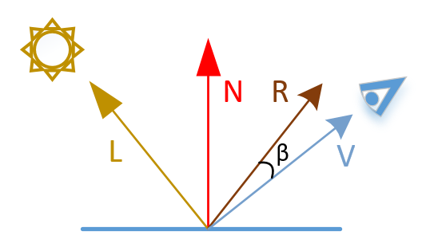

# PhongJS — Demo interactiva del modelo de iluminación de Phong

Demo pedagógica del modelo de iluminación de Phong renderizada **por software** sobre Canvas 2D. No usa WebGL ni ninguna librería gráfica: cada píxel de la esfera se calcula explícitamente en JavaScript, lo que hace el código directamente legible como referencia de estudio.

---

## Tabla de contenidos

1. [Contexto histórico](#1-contexto-histórico)
2. [El modelo de iluminación de Phong](#2-el-modelo-de-iluminación-de-phong)
   - 2.1 [Componente ambiental](#21-componente-ambiental)
   - 2.2 [Componente difusa — Ley de Lambert](#22-componente-difusa--ley-de-lambert)
   - 2.3 [Componente especular](#23-componente-especular)
   - 2.4 [Ecuación completa](#24-ecuación-completa)
3. [Vectores del modelo](#3-vectores-del-modelo)
4. [Rasterización por software](#4-rasterización-por-software)
   - 4.1 [Mapeo píxel → normal de esfera](#41-mapeo-píxel--normal-de-esfera)
   - 4.2 [Proyección ortográfica](#42-proyección-ortográfica)
   - 4.3 [Pipeline de render](#43-pipeline-de-render)
5. [Diagrama polar — BRDF simplificada](#5-diagrama-polar--brdf-simplificada)
6. [Parámetros interactivos](#6-parámetros-interactivos)
7. [Estructura del proyecto](#7-estructura-del-proyecto)
8. [Arquitectura del código](#8-arquitectura-del-código)
9. [Decisiones de implementación](#9-decisiones-de-implementación)
10. [Limitaciones del modelo](#10-limitaciones-del-modelo)
11. [Referencias](#11-referencias)

---

## 1. Contexto histórico

**Bui Tuong Phong** presentó su modelo de iluminación en su tesis doctoral en la Universidad de Utah en 1973, publicada en 1975. Formó parte de la generación de investigadores que sentaron las bases del rendering interactivo moderno junto a Henri Gouraud (interpolación de normales, 1971) y James Blinn (variante mejorada, Blinn-Phong, 1977).

El modelo de Phong es **empírico**: no deriva de la física de la óptica ondulatoria ni de la transferencia de radiación, sino que aproxima el aspecto visual de las superficies iluminadas de forma que resulte convincente y computable en tiempo real. Esta aproximación fue el estándar en hardware gráfico durante décadas (OpenGL y DirectX la usaron como modelo por defecto hasta la generalización de los shaders programables).

Hoy en día los motores modernos usan modelos **PBR** (Physically Based Rendering) derivados de la ecuación de renderizado de Kajiya (1986), pero Phong sigue siendo el punto de partida pedagógico obligatorio por su claridad conceptual.

---

## 2. El modelo de iluminación de Phong

El modelo descompone la luz reflejada por una superficie en **tres términos independientes**, cada uno asociado a un fenómeno físico diferente:

```
I = Iₐ·kₐ  +  Id·kd·(L·N)  +  Ie·ke·(R·V)ⁿ
   ───────    ────────────    ──────────────
   ambiental    difusa          especular
```

| Símbolo | Significado | Rango |
|---------|-------------|-------|
| `I`     | Intensidad final reflejada | [0, ∞) |
| `Iₐ, Id, Ie` | Intensidades de la fuente (ambiental, difusa, especular) | [0, 1] |
| `kₐ, kd, ke` | Coeficientes del material (cuánto refleja cada componente) | [0, 1] |
| `N` | Normal unitaria en el punto de la superficie | vector 3D |
| `L` | Vector unitario del punto hacia la fuente de luz | vector 3D |
| `R` | Vector de reflexión perfecta de `L` respecto a `N` | vector 3D |
| `V` | Vector unitario del punto hacia el observador (cámara) | vector 3D |
| `n` | Exponente de brillo (*shininess*) | [1, 200+] |

### 2.1 Componente ambiental

```
Iamb = Iₐ · kₐ
```

La luz **ambiental** modela toda la iluminación indirecta: reflexiones entre superficies, luz de cielo, rebotes múltiples. En la naturaleza este fenómeno es extraordinariamente complejo (requiere técnicas como *global illumination*, *path tracing* o *radiosity*), pero Phong lo simplifica a una **constante uniforme** que ilumina toda la superficie por igual, sin importar la orientación ni la posición.

- **Consecuencia**: ningún punto de la superficie queda completamente negro. Simula que "siempre llega algo de luz de algún lado".
- **Limitación**: al ser constante, no genera ninguna variación visual por sí sola. Sube el nivel mínimo de brillo global.
- **En PBR moderno** se reemplaza por mapas de irradiancia (IBL, *Image-Based Lighting*) que capturan la iluminación ambiental real del entorno.

### 2.2 Componente difusa — Ley de Lambert

```
Idif = Id · kd · max(0, L·N)  =  Id · kd · max(0, cos θ)
```

donde `θ` es el ángulo entre `L` y `N`.

La componente difusa modela superficies **rugosas a nivel microscópico** (madera, yeso, tela, piel), que dispersan la luz recibida de forma uniforme en todas las direcciones. Estas superficies se llaman **Lambertianas** en honor a Johann Heinrich Lambert, quien formuló la ley en 1760.

**Intuición geométrica de la Ley de Lambert**: cuando un rayo de luz incide perpendicularmente sobre una superficie (`θ = 0°`), toda su energía se concentra en una pequeña área. Cuando incide de forma rasante (`θ → 90°`), la misma energía se distribuye sobre un área mucho mayor. La energía por unidad de área es proporcional a `cos θ`.

```
θ = 0°  →  cos θ = 1  →  máxima iluminación (luz perpendicular)
θ = 45° →  cos θ ≈ 0.7
θ = 90° →  cos θ = 0  →  superficie tangente a la luz, no recibe energía
θ > 90° →  cos θ < 0  →  cara trasera (descartada con max(0, …))
```

La componente difusa **no depende de V** (la posición del observador): una superficie Lambertiana se ve igual de brillante desde cualquier ángulo de visión, lo que la hace fácil de computar.

### 2.3 Componente especular

```
Iesp = Ie · ke · max(0, R·V)ⁿ  =  Ie · ke · max(0, cos φ)ⁿ
```

donde `φ` es el ángulo entre `R` y `V`.

La componente especular modela superficies **pulidas** (metales, plásticos, agua) que producen un reflejo concentrado en una dirección. El reflejo es máximo cuando el observador está exactamente en la dirección de reflexión especular (`φ = 0`, `R ∥ V`) y decae rápidamente al alejarse.

**El vector de reflexión R** se calcula como el simétrico de `L` respecto a `N`:

```
R = 2(L·N)N − L
```

Derivación geométrica: la proyección de `L` sobre `N` es `(L·N)N`. Su doble es `2(L·N)N`. Restando `L` obtenemos el vector que forma el mismo ángulo con `N` pero al otro lado: el rayo reflejado especularmente.

**El exponente `n`** (shininess) controla la "dureza" del brillo:

```
n = 1    → lóbulo muy amplio, superficies muy rugosas o mate brillante
n = 10   → plástico mate
n = 32   → plástico semipulido (valor por defecto en esta demo)
n = 100  → metal pulido
n = 200+ → espejo, superficie ultrapolida
```

A mayor `n`, el lóbulo `cosⁿ φ` se estrecha: el brillo es más pequeño pero más intenso. Esto se ve claramente en el diagrama polar de la demo.

> **Nota histórica**: James Blinn propuso en 1977 una variante más eficiente y físicamente más coherente: sustituir `R·V` por `H·N`, donde `H = normalize(L + V)` es el *half-vector*. El modelo **Blinn-Phong** produce resultados muy similares con menos cómputo y es el que implementaron las tarjetas gráficas de los años 90-2000.

### 2.4 Ecuación completa

La intensidad final se obtiene sumando los tres términos:

```
I = Iₐ·kₐ  +  Id·kd·cos θ  +  Ie·ke·cosⁿ φ
```

Donde los cosenos se garantizan no negativos con `max(0, …)`. En esta demo, la suma puede superar `1.0` (lo que se satura a `255` en el canal de color de 8 bits).

---

## 3. Vectores del modelo



Todos los vectores deben estar **normalizados** (módulo = 1) para que los productos escalares sean directamente cosenos. Si algún vector no está normalizado, el producto `L·N` no daría `cos θ` sino `|L||N|cos θ`, escalando incorrectamente la intensidad.

En esta demo:
- **N** se deriva analíticamente de la geometría de la esfera (ver sección 4.1) y es unitario por construcción.
- **L** se construye a partir del ángulo del slider y se normaliza explícitamente en `buildRenderState`.
- **V** = `(0, 0, 1)` (observador en el eje Z, proyección ortográfica), simplificando `R·V` a `Rz / |R|`.

---

## 4. Rasterización por software

En lugar de usar la GPU (WebGL/fragment shader), este proyecto implementa el **rasterizador en la CPU** sobre la API Canvas 2D. El objetivo es que el código sea directamente legible como pseudocódigo.

### 4.1 Mapeo píxel → normal de esfera

La esfera de radio `r` está centrada en `(cx, cy)` en coordenadas de pantalla. Para un píxel `(px, py)`:

```
dx = px − cx       (desplazamiento horizontal desde el centro)
dy = py − cy       (desplazamiento vertical desde el centro)
dist² = dx² + dy²  (distancia al cuadrado)
```

**Condición de pertenencia a la esfera**: `dist² ≤ r²`
(comparación sin `sqrt`, más eficiente)

La normal en ese punto asume **proyección ortográfica** (todos los rayos de visión son paralelos y perpendiculares al plano de pantalla):

```
nx = dx / r           en [-1, 1]
ny = dy / r           en [-1, 1]
nz = √(1 − nx² − ny²) ≥ 0   (cara frontal)
```

Puede verificarse que `|N| = 1`:
`nx² + ny² + nz² = dx²/r² + dy²/r² + (1 − dist²/r²) = dist²/r² + 1 − dist²/r² = 1 ✓`

**Optimización implementada**: en lugar de calcular `dx/r` y `dy/r` con dos divisiones, se precalcula `invR = 1/r` fuera del bucle y se multiplica: `nx = dx * invR`. Las multiplicaciones son más rápidas que las divisiones en la mayoría de las arquitecturas. Con ~47.000 píxeles por frame (área de la esfera de radio 96 px ≈ π·96² ≈ 28.953 píxeles), el ahorro es medible.

### 4.2 Proyección ortográfica

Esta demo usa proyección **ortográfica** (paralela), no perspectiva. Consecuencias:

- El observador `V` es siempre `(0, 0, 1)` para todos los píxeles.
- No hay efecto de perspectiva: el tamaño percibido no varía con la profundidad.
- La simplificación es razonable para una demo pedagógica donde la forma de la esfera es perfectamente simétrica y el foco está en la iluminación, no en la proyección.

En un rasterizador real con perspectiva, `V` variaría por píxel y el cálculo sería más costoso.

### 4.3 Pipeline de render

```
update()                        ← disparado por sliders o cambio de modo
    │
    ├── buildRenderState()       ← convierte grados→rad, normaliza L
    │
    ├── drawSphere(state)
    │       │
    │       ├── para cada píxel (px, py) dentro de la esfera:
    │       │       ├── calcular normal N (analítica)
    │       │       ├── computePhong(N, L, …)
    │       │       ├── intensityForMode(components, mode)
    │       │       └── escribir RGBA en ImageData buffer
    │       │
    │       └── ctx.putImageData()   ← un solo flush al canvas
    │
    └── drawPolar(state)
            │
            └── para θ = 0° … 180°:
                    ├── N = (sin θ, 0, cos θ)
                    ├── computePhong(N, L, …)
                    └── dibujar punto del polígono polar
```

El buffer `ImageData` se **reutiliza entre frames** para evitar allocations: se resetea con `fill(0)` (más rápido que `createImageData` + `clearRect`) y se actualiza en el mismo objeto. Esto reduce la presión sobre el Garbage Collector, crítico en bucles de render de alta frecuencia.

---

## 5. Diagrama polar — BRDF simplificada

El canvas `#polar` muestra la **distribución angular** de la intensidad reflejada.

### ¿Qué es una BRDF?

La **BRDF** (*Bidirectional Reflectance Distribution Function*) es una función `f(ωᵢ, ωₒ)` que describe cuánta luz incidente en la dirección `ωᵢ` sale reflejada en la dirección `ωₒ`. Tiene unidades de sr⁻¹ (por estereorradián) y satisface la reciprocidad de Helmholtz: `f(ωᵢ, ωₒ) = f(ωₒ, ωᵢ)`.

El diagrama polar de esta demo es una **sección 2D** de esa función en el **plano XZ** (y = 0), con:
- `L` fijo en la dirección del slider de ángulo de luz.
- `V = (0, 0, 1)` (observador fijo en +Z).
- `N` barriendo `θ ∈ [0°, 180°]` en el plano XZ.

Para cada ángulo `θ`, se evalúa `computePhong` y se mapea la intensidad a una distancia radial:

```
pointX = cx + sin(θ) · r · I(θ)
pointY = cy − cos(θ) · r · I(θ)
```

Los tres lóbulos resultantes tienen formas características:

| Componente | Forma del lóbulo | Explicación |
|------------|-----------------|-------------|
| **Ambiental** | Semicírculo perfecto | Constante, no depende de θ |
| **Difusa** | Lóbulo coseno (casi elipse) | Máximo cuando `N ∥ L`, simétrico, suave |
| **Especular** | Lóbulo estrecho y puntiagudo | Se concentra en `θ` tal que `R ∥ V`; más estrecho a mayor `n` |

La superposición de los tres lóbulos en modo **Modelo completo** ilustra visualmente cómo cada componente contribuye a la reflexión total.

---

## 6. Parámetros interactivos

| Control | Símbolo | Rango | Efecto visual |
|---------|---------|-------|---------------|
| **kₐ** coef. ambiental | kₐ | 0 – 1 | Sube o baja el nivel mínimo de brillo global; a kₐ=0 las zonas traseras quedan negras |
| **kd** coef. difuso | kd | 0 – 1 | Controla la intensidad del gradiente suave de iluminación; a kd=0 desaparece la forma tridimensional |
| **ke** coef. especular | ke | 0 – 1 | Controla la intensidad del punto brillante; a ke=0 la superficie parece completamente mate |
| **n** shininess | n | 1 – 200 | A valores bajos el brillo es grande y difuso; a valores altos es pequeño y puntual |
| **Ángulo de luz** | la | 0° – 85° | Rota el vector L; a 0° la luz viene frontal, a 85° es casi rasante |

### Combinaciones representativas de materiales

| Material | kₐ | kd | ke | n |
|----------|----|----|----|---|
| Yeso / tiza | 0.3 | 0.9 | 0.0 | 1 |
| Plástico rojo | 0.1 | 0.6 | 0.5 | 32 |
| Metal pulido | 0.0 | 0.2 | 1.0 | 150 |
| Piel humana | 0.2 | 0.8 | 0.1 | 8 |
| Espejo | 0.0 | 0.0 | 1.0 | 200 |

---

## 7. Estructura del proyecto

```
PhongJS/
├── index.html          # Interfaz HTML: tabs, canvas, sliders
├── css/
│   └── style.css       # Estilos: reset, componentes UI, sliders cross-browser
├── phong/
│   └── phong.js        # Motor completo: Phong, rasterizador, diagrama polar
└── README.md           # Este fichero
```

No hay dependencias externas, herramientas de build ni pasos de instalación. El proyecto funciona abriendo `index.html` directamente en el navegador o sirviéndolo con cualquier servidor HTTP estático.

---

## 8. Arquitectura del código

`phong.js` está organizado como un **IIFE** (*Immediately Invoked Function Expression*):

```javascript
(function PhongDemo() {
  // todo el estado y las funciones son privados
})();
```

Este patrón encapsula el estado en un scope privado, evitando contaminar el objeto global `window`. Es equivalente a un módulo ES en un entorno sin bundler.

### Flujo de datos

```
[HTML sliders] ──input event──▶ update()
                                    │
                               buildRenderState()
                               (grados→rad, normalizar L)
                                    │
                    ┌───────────────┴───────────────┐
                    ▼                               ▼
              drawSphere()                    drawPolar()
           (rasterización                  (diagrama polar
            píxel a píxel)                  θ = 0°…180°)
```

### Separación de responsabilidades

| Función | Responsabilidad |
|---------|----------------|
| `computePhong()` | Física pura — calcula los tres componentes. Función pura sin efectos secundarios. |
| `intensityForMode()` | Selección del modo — elige qué componente mostrar. |
| `buildRenderState()` | Preparación del frame — convierte inputs a vectores normalizados. |
| `drawSphere()` | Renderizado — rasteriza la ecuación píxel a píxel. |
| `drawPolar()` | Visualización — traza el diagrama de distribución angular. |
| `update()` | Coordinación — lee sliders, llama al resto. |
| `setMode()` | UI — sincroniza tabs y fórmula visible. |

La función `computePhong` es una **función pura**: no lee ni escribe ningún estado global, no tiene efectos secundarios y dado el mismo input siempre produce el mismo output. Esto la hace trivialmente testeable y reutilizable.

---

## 9. Decisiones de implementación

### Por qué Canvas 2D y no WebGL

En WebGL, el fragment shader ejecutaría `computePhong` en la GPU para miles de píxeles en paralelo, siendo órdenes de magnitud más rápido. Sin embargo, el código GLSL del shader y la infraestructura de WebGL (VAOs, VBOs, programas, uniforms) obscurecen la lógica de Phong bajo capas de API.

Con Canvas 2D el bucle de rasterización es JavaScript directo: el alumno puede leer `computePhong(N, L, …)` y correlacionarlo exactamente con la ecuación matemática sin intermediarios. **El objetivo es la claridad, no el rendimiento.**

### Reutilización del buffer ImageData

```javascript
if (!_sphereImageData || _sphereImageData.width !== W || _sphereImageData.height !== H) {
  _sphereImageData = ctx.createImageData(W, H);
}
_sphereImageData.data.fill(0);
```

Crear un `ImageData` nuevo cada frame implica reservar `W × H × 4` bytes en el heap de JavaScript y eventualmente liberar el anterior con el Garbage Collector. En un bucle de render a 60 fps, el GC puede pausar el hilo principal produciendo *jank* visible. Reutilizar el buffer y resetear con `fill(0)` evita esta presión.

### Precálculo de `invR` y `r²`

```javascript
const invR = 1 / r;   // fuera del doble bucle
const r2   = r * r;   // fuera del doble bucle

// dentro del bucle: dx * invR en lugar de dx / r
```

Con `r = 96` px, el área de la esfera es `π·96² ≈ 28.953 píxeles`. Precalcular estas dos constantes ahorra ~29.000 divisiones y ~29.000 multiplicaciones por frame. Las divisiones son especialmente costosas en CPUs modernas (latencia ~20–40 ciclos vs ~3–5 de la multiplicación).

### Normal por construcción unitaria

La normal `N = (nx, ny, nz) = (dx·invR, dy·invR, √(1 − dist2·invR²))` tiene módulo exactamente 1 por construcción algebraica, sin necesidad de normalizar explícitamente. Esto evita una raíz cuadrada adicional y la potencial división por cero en la normalización.

### Observador simplificado en +Z

Asumir `V = (0, 0, 1)` para todos los píxeles simplifica `R·V = Rz/|R|`, eliminando dos multiplicaciones y una suma por píxel. La diferencia visual respecto a `V` variable (perspectiva real) es inapreciable en una esfera pequeña con proyección ortográfica.

### Contextos Canvas cacheados

```javascript
// En init(), una sola vez:
DOM.ctxSphere = getEl('sphere').getContext('2d');

// En drawSphere(), cada frame:
const ctx = DOM.ctxSphere;  // O(1), sin consulta al navegador
```

`getContext('2d')` es una llamada a la API del navegador que cruza la frontera JavaScript/C++ del motor. Aunque internamente devuelve el mismo objeto, llamarla cada frame añade overhead innecesario.

---

## 10. Limitaciones del modelo

Phong es un modelo empírico de los años 70 con limitaciones bien conocidas:

| Limitación | Descripción | Solución moderna |
|------------|-------------|-----------------|
| **No conserva energía** | La suma `kₐ + kd + ke` puede superar 1, emitiendo más luz de la recibida. | Modelos PBR con normalización de energía. |
| **BRDF no recíproca** | `f(L→V) ≠ f(V→L)` en general, violando la física. | Cook-Torrance, GGX. |
| **Sin interreflexiones** | La componente ambiental constante ignora las sombras indirectas y el *color bleeding*. | Radiosity, path tracing, SSAO. |
| **Sin sombras** | No hay cálculo de visibilidad entre superficies. | Shadow maps, ray tracing. |
| **Sin Fresnel** | La reflexión especular no aumenta en ángulos rasantes como predice la óptica. | Ecuaciones de Fresnel, aproximación de Schlick. |
| **Proyección ortográfica** | V constante para todos los píxeles. | Perspectiva con V variable por píxel. |
| **Sin texturas** | Los coeficientes son uniformes por objeto. | Texture maps para kd, ke, normal maps. |

---

## 11. Referencias

### Artículos y papers originales

- **Phong, B.T.** (1975). *Illumination for Computer Generated Pictures*. Communications of the ACM, 18(6), 311-317. [Abrir PDF](./pdf/Phong_1975.pdf)
- **Blinn, J.F.** (1977). *Models of light reflection for computer synthesized pictures*. SIGGRAPH Computer Graphics, 11(2), 192-198. [Abrir PDF](./pdf/Blinn_1977.pdf)
- **Lambert, J.H.** (1760). *Photometria*. (Ley del coseno, base del término difuso.)

### Libros de referencia

- **Shirley, P. & Marschner, S.** — *Fundamentals of Computer Graphics* (4ª ed.) — Introducción práctica al modelo de Phong y al pipeline de render.
- **Foley, van Dam, Feiner, Hughes** — *Computer Graphics: Principles and Practice* — Referencia clásica con derivación matemática detallada.
- **Pharr, Jakob, Humphreys** — *Physically Based Rendering* (pbrt, 4ª ed.) — Modelo formal de BRDFs y transición del modelo de Phong a PBR.

### Recursos online

- [WebGL2 Fundamentals](https://webgl2fundamentals.org/) — Pipeline WebGL con ejemplos de iluminación de Phong en shaders GLSL.
- [The Book of Shaders](https://thebookofshaders.com/) — Introducción a GLSL con ejemplos visuales interactivos.
- [Inigo Quilez — Articles](https://iquilezles.org/articles/) — Técnicas avanzadas de shading y ray marching.
- [Learn OpenGL — Basic Lighting](https://learnopengl.com/Lighting/Basic-Lighting) — Implementación de Phong en OpenGL con explicación paso a paso.
